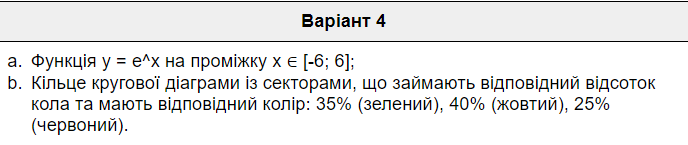

#### This is *Lab №6* from *Mobile Systems Development*
#### Author: *Artem Sevruk*, group *IV-71*, variant *7120 % 6 == 4*
____
Required Chart and Graph for my variant:

____
____
During completing this #6 Lab I haven't faced any serious or valuable problem:
* My Pie Chart looks good, but I think there are ways, even easier ways, to create it more elegancy using other libraries. What do you think?
* My Graph can be moved by sliding it in each part of the screen and also zoomed by double tapping.
____

***Please, feel free to leave all possible comments & suggestions & advices & helps :) Thanks :)***
